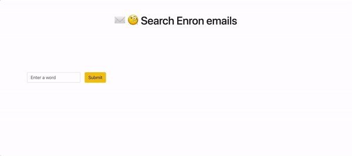
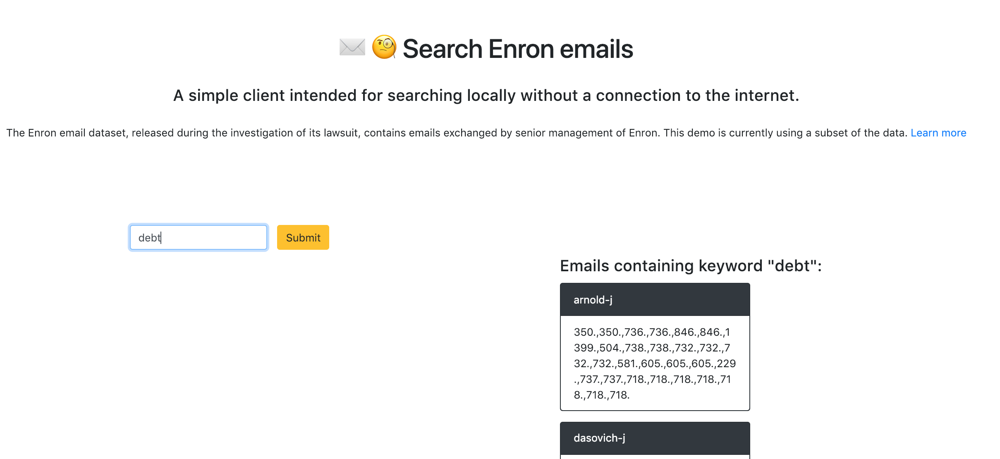

# Search Enron Emails 



A mini search engine for Enron emails
Web client demo (most effective on a desktop browser): http://enron-search.herokuapp.com/ 

## About the data
The [Enron email dataset](https://www.cs.cmu.edu/~./enron/) is a large folder containing emails exchanged by senior management of Enron, organized into folders. This became public following the organization's fraud and corruption scandal, and contains a total of about 0.5M messages (1 GB).

## The Challenge
This goal of this project is to implement a method of searching through the large Enron email dataset. It should behave like a lightweight search engine, with features like autocomplete and efficiency. It is meant for search _on a mobile device_, without connection to the internet and limited memory. But contents can be stored in disk.

## Implementation
The Enron email corpus is about 1 GB in size.

The first step was to pre-process the content to create 2 main mappings:
1. Mapping from word to individual whose inbox contains that word (and id's of respective files)
2. A prefix tree from all the significant words in the entire corpus. This can be useful for functionality like autocomplete and searches like "lawsuit" when user types "law"

This processing step only needs to be done once.
When the app is initialized with `app.py`, it loads the prefix tree (trie) and word map from disk. The prefix tree is queried as the user types, and the map is queried when the user hits a pause in typing, selects a suggestion or hits the "Search" button. 



Files ending with `_local.py` are intended for local testing and use a smaller subset of the email data.

### `process.py` and `process_local.py`:
From the Enron email dataset, creates the following mapping:  
`word -> individuals with this word in their mailbox -> email ID containing that word (for each individual)`  

### `trie.py`: Autocomplete functionality
A standard prefix tree supporting insertion, search, and traversing through children to get suffixes

### `app.py`: User interactions
With the help of Flask, queries the word map and trie to display results in the UI.


## Local CLI version
To test the functionality locally (without any connection to the internet):

Clone this repository (The sample set was downsized to avoid bloating this repository on GitHub).

Run `python search_local.py`

After initialization, try searching for a term in the emails. 

Example:
```
$ python search.py
Initializing....

search term: life
emails by arnold-j containing 'life': ['1029.', '248.', '1005.', '1399.', '606.', '732.', '605.', '162.', '354.', '379.', '406.', '361.', '408.', '136.', '609.']
emails by lavorato-j containing 'life': ['112.', '430.', '289.', '277.']
emails by townsend-j containing 'life': ['81.']
emails by symes-k containing 'life': ['1994.', '1722.', '50.', '2803.', '3293.', '1721.', '1483.', '1886.', '84.', '2688.', '2851.', '2779.', '2438.', '2209.', '1127.', '156.', '3124.', '2777.', '69.', '2495.', '959.', '63.', '2510.', '1212.', '895.', '984.', '2327.', '2806.', '2727.', '1586.', '2641.', '2796.', '2775.', '1202.', '1284.', '2854.', '2817.', '1267.', '2757.', '1122.', '2778.', '2439.', '2528.', '1263.', '1493.', '3039.', '2689.', '1398.', '2801.', '2959.', '337.', '2802.', '2217.']
emails by wolfe-j containing 'life': ['109.', '190.', '56.']
emails by mcconnell-m containing 'life': ['838.', '474.', '601.', '642.', '854.', '920.', '574.', '599.', '1013.', '935.', '783.', '1135.', '562.', '122.', '853.', '378.', '668.', '851.', '837.', '1134.', '1025.', '793.', '247.', '843.', '489.', '844.', '847.', '1068.', '856.', '600.']
------------
completions for this term:  ['lifeblood', 'lifesaver', 'lifestyle', 'lifesized', 'lifeas', 'lifelong', 'lifeless', 'lifetime']

search term: bye
Word bye was not found. Try another one!
```

## Challenges and Potential Improvements
The biggest challenge with this project was optimizing for disk vs memory use. There are half a million objects in this corpus. How do we return all the emails containing a term, without looking through each email? And how do we optimize for mobile usage, so that the user can see results and term suggestions as they type? 

In the current state, this tool loads a pre-processed trie into memory as well as the word map (a python dictionary). The trie works reasonably well to enable autocomplete, but loading a huge python dictionary into memory proves burdensome.

One way to address this convert the contents of the dictionary into database objects which can be queried at runtime. 
You'll notice that in parts of the code like `app.py`, there's already some implementation for storing information into a database using SQLAlchemy.
